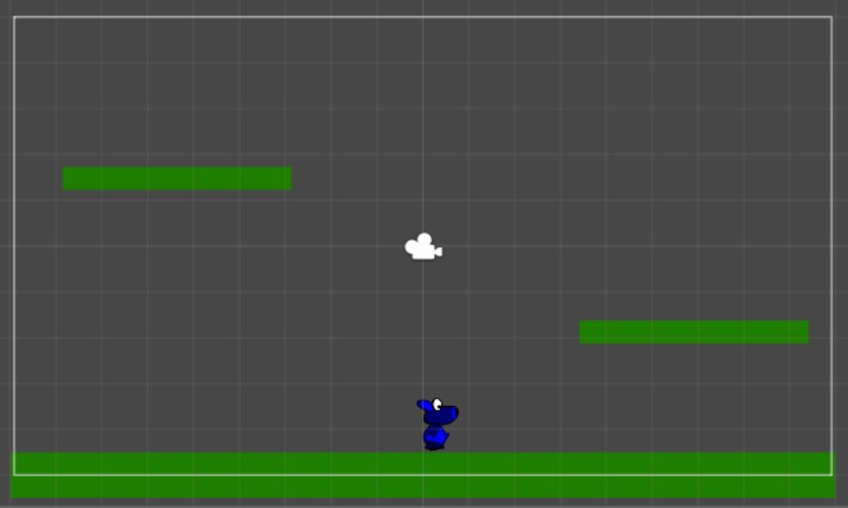
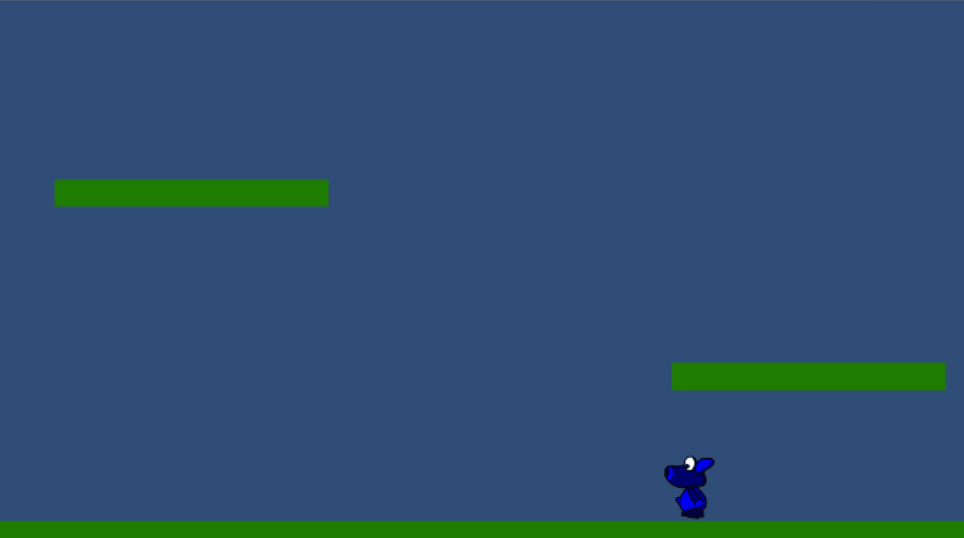
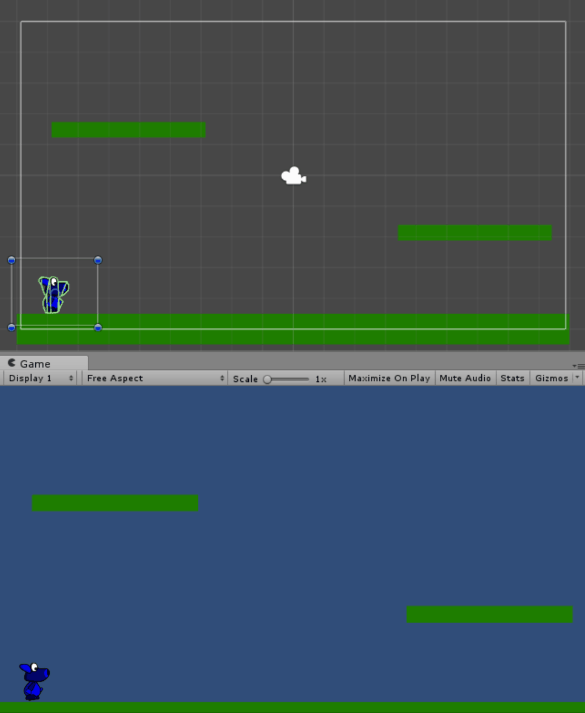
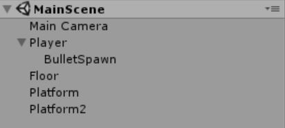
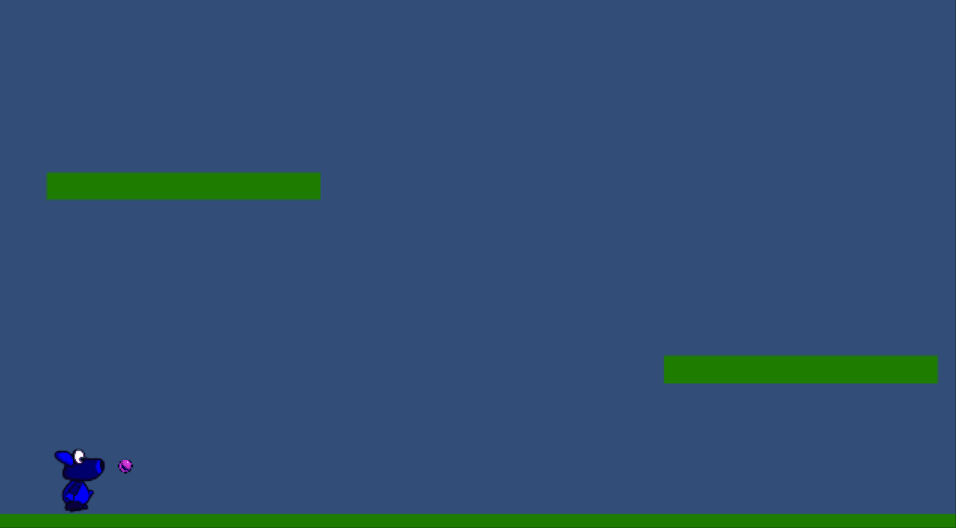

¡Hola a todos! En esta serie de post vamos a ver cómo desarrollar un videojuego con Unity en C#. El videojuego se llama **Crawbar** y aún está por definir, irá evolucionando con el tiempo. Lo que sí podemos saber a día de hoy es que va a ser un **juego en 2D**.

## Introducción

Todo el código del videojuego va a estar disponible en el [GitHub de Ikeín y yo](https://github.com/ikeinyyo/Crowbar/tree/001). Podéis descargar los Assets para seguir este post [aquí](https://github.com/ikeinyyo/Crowbar/blob/001/Assets/001.zip).

En este post **vamos a empezar con el control del jugador**. De momento el jugador va a poder **moverse hacia los lados, disparar y saltar**.

## Escena principal

Lo primero que vamos a hacer es añadirle al GameObject del player un **Collider2D** y un **Rigidbody2D**. Con estos dos componentes podremos detectar las colisiones y trabajar con el player como si fuera un cuerpo afectado por las fuerzas, masa, etc.

Antes de seguir **añadimos el suelo y un par de plataformas a las que le añadiremos una etiqueta de `"Floor"`** y un **Collider2D**.



## Movimiento básico

Añadimos al player un **Script de C#** para manejar todo el movimiento del jugador, lo llamaremos **PlayerController**.

Lo primero que vamos a hacer es **en el método Start obtener el componente de Rigidbody2D** para poder aplicarle velocidad y fuerza.

```csharp
private Rigidbody2D _rigidbody2D;

private void Start()
{
    _rigidbody2D = GetComponent<Rigidbody2D>();
}
```

Ahora vamos a crear un método **Move** donde controlar el movimiento horizontal del Player. A este método lo llamaremos desde el método Update.

```csharp
public float Speed = 8;

private void Move()
{
    var horizontalMovement = Input.GetAxis("Horizontal");
    _rigidbody2D.velocity = new Vector2(horizontalMovement * Speed, 0);
}

void Update()
{
    Move();
}
``` 
Hemos creado una **propiedad pública llamada *Speed*** que nos permite **modificarla desde el editor de Unity** para controlar la velocidad del jugador.

Con el método de ` Input.GetAxis("Horizontal")` obtenemos el desplazamiento horizontal de la entrada del juego. Esto no abstrae de comprobar si ha sido pulsada la *tecla A* o la *fecha izquierda* para movernos a la izquierda. Nos devuelve un **valor dentro del rango [-1,1]**.

**Nota:** En las Settings del proyecto se pueden modificar las teclas o controles mapeados a cada acción.

Ahora **cambiamos la velocidad del Rigidbody2D del Player** con el movimiento horizontal que hemos obtenido y el factor de velocidad que es el multiplicador. De momento la velocidad en Y la dejamos a 0.

## Flip

Para darle un mejor efecto al movimiento vamos a voltear el sprite del player cuando nos movamos para **hacer que mire hacia el lado del movimiento**. Creamos un nuevo método llamado Flip para este cometido.

```csharp
private bool _isRightMove = true;

private void Flip()
{
    var horizontalMovement = Input.GetAxis("Horizontal");
    if (horizontalMovement < 0 && _isRightMove || horizontalMovement > 0 && !_isRightMove)
    {
        _isRightMove = !_isRightMove;
        gameObject.transform.localScale = Vector3.Scale(gameObject.transform.localScale, new Vector3(-1, 1, 1));
    }
}

void Update()
{
    Move();
    Flip();
}
```

Simplemente tenemos que detectar cuando ha habido un cambio de dirección en el movimiento y **escalar el player por -1 en la X**. Con esto conseguimos voltear el player.



## Salto
La implementación del salto la podemos de muchas formas. En nuestro caso vamos a utilizar las fuerzas.

Vamos a crear un método Jump con la siguiente implementación.

```csharp
public float JumpForce = 10;

private bool _isJump = true;

private void Jump()
{
    if (!_isJump && Input.GetButtonDown("Jump"))
    {
        _rigidbody2D.AddForce(new Vector2(0, JumpForce), ForceMode2D.Impulse);
    }
}

private void OnCollisionEnter2D(Collision2D collision)
{
    if (collision.gameObject.tag == "Floor")
    {
        _isJump = false;
    }
}

private void OnCollisionExit2D(Collision2D collision)
{
    if (collision.gameObject.tag == "Floor")
    {
        _isJump = true;
    }
}

void Update()
{
    Move();
    Flip();
    Jump();
}
```

Vamos a mantener una **variable `_isJump`** para saber si estamos saltando o no. El valor lo vamos a actualizar en los **métodos de gestión de las colisiones**. Si abandonamos los objetos que están etiquetados como *Floor* o entramos en uno de ellos la variable se actualizará.

> Esto nos va a impedir saltar si estamos en el aire.

Para saltar simplemente añadimos una fuerza hacia arriba con el método `AddForce`.

**Nota:** Si quisiéramos hacer un doble salto podríamos trabajar con una variable entera para mantener un contador de saltos en vez de un booleano de si está saltando o no.


## Mejorando el salto
Para mejorar un poco la sensación del movimiento cuando el player está en el aire lo que vamos a hacer es **reducir a la mitad la velocidad horizontal durante el vuelo**.

Así que vamos al método **Jump** y lo modificamos un poco.

```csharp
private void Move()
{
    var horizontalMovement = Input.GetAxis("Horizontal");
    var velocity = _isJump ? horizontalMovement * Speed / 2 : horizontalMovement * Speed;
    _rigidbody2D.velocity = new Vector2(velocity, _rigidbody2D.velocity.y);
}
```

En caso de estar **en el aire reducimos la velocidad horizontal** de movimiento y **mantenemos la velocidad Y** que lleve el player en ese momento.



## Disparo

Lo primero que vamos a hacer es crear un objeto **Bullet** al que le vamos a añadir un **Script C#** llamado **BulletController** con un código muy sencillo.

```csharp
public float Speed = 20;

public void Shot(float direction)
{
    var rigidbody2D = GetComponent<Rigidbody2D>();
    rigidbody2D.velocity = new Vector2(direction * Speed, 0);
}

private void OnBecameInvisible()
{
    Destroy(gameObject);
}
```

Definimos una variable pública, que podremos configurar desde el editor, para la velocidad y creamos un método **Shot** al que llamaremos desde el controlador de player para asignarle una velocidad.

**Nota:** Para evitar que se acumulen las balas por el mundo en el método *OnBecameInvisible* destruimos el objeto.

**Guardamos este *prefab* en la carpeta Resources** para poder encontrarlo desde el código. Por otro lado, en el editor vamos a crear dentro del GameObject player un Empty Object que nos sirva como origen para las balas. Lo llamaremos **BulletSpawn**.



Ahora nos vamos al **PlayerController** y creamos un método **Shot**.

```csharp
private void Shot()
{
    if (Input.GetButtonDown("Fire1"))
    {
        var bulletSpawn = transform.FindChild("BulletSpawn");

        var bullet = Instantiate(Resources.Load("Bullet"), bulletSpawn.position, Quaternion.identity) as GameObject;

        bullet.GetComponent<BulletController>().Shot(_isRightMove ? 1 : -1);

        Physics2D.IgnoreCollision(gameObject.GetComponent<Collider2D>(), bullet.GetComponent<Collider2D>());
    }
}

void Update()
{
    Move();
    Flip();
    Jump();
    Shot();
}
```

**Nota:** Al guardar un *prefab* en la carpeta de *Resources* lo podemos buscar desde el código con el método `transform.FindChild("Name_of_Resource”)`. 

Simplemente **instanciamos un objeto *Bullet*, accedemos a su *BulletController* y llamamos al método *Shot*** con la dirección del disparo.

Por último hacemos que se ignore las colisiones entre esa bala y el Player con el método `Physics2D.IgnoreCollision()`.

## Resumen

Como hemos podido ver es bastante sencillo añadir la funcionalidad básica a un jugador. Es verdad que el acabado no es del todo perfecto y habrá que ir ajustando cosas, pero es una muy buena primera versión.



Hemos necesitado únicamente dos *scripts*: uno para el control de la bala y otro para el Player. Gracias al Rigidbody2D del player hemos podido trabajar con fuerzas y velocidades que nos han facilitado mucho crear el movimiento del jugador.

## Referencias

**Sprite del player:** creado por [pechvogel](https://opengameart.org/users/pechvogel) - [Descarga](https://opengameart.org/content/blue-character)

**Sprite de la bala:** creado por [fsvieira](https://opengameart.org/users/fsvieira) -  [Descarga](https://opengameart.org/content/vector-svg-balls-with-5-colors)

## Siguiente

En el siguiente post veremos cómo añadir enemigos y controlar la puntuación.

¡Nos vemos en el futuro!
