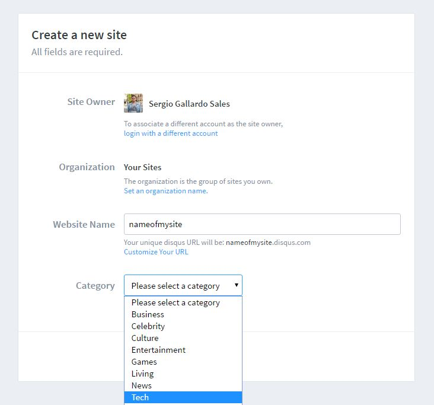
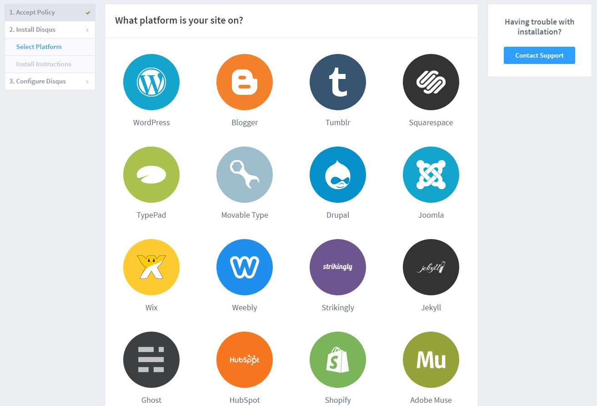
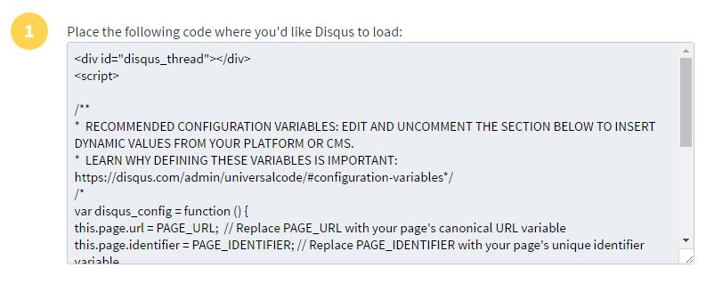
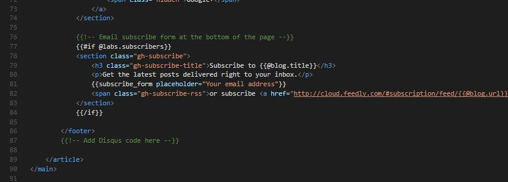
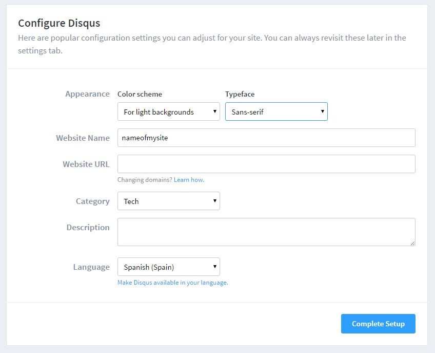
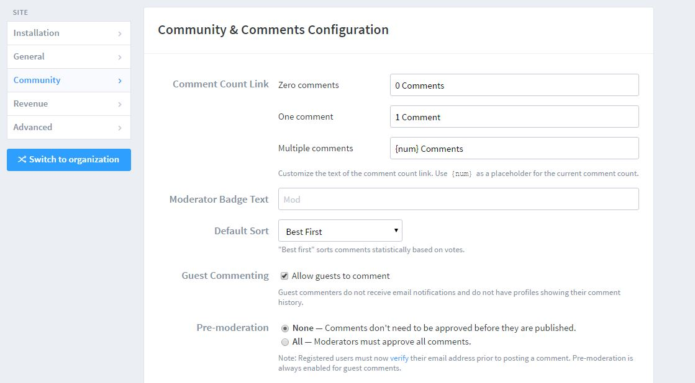
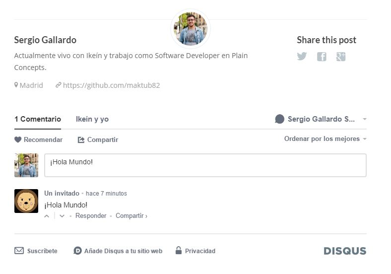

¡Hola a todos! Hace poco que empecé a utilizar Ghost como plataforma de blogs. Poco a poco voy viendo cómo puedo sacarle más partido. En esta ocasión os voy a enseñar cómo poder habilitar comentarios en los post.

## Ghost for Beginner

Antes de empezar me gustaría citar la fuente dónde encontré como hacerlo. Ghost for Beginner - [How to Add Comments to Ghost]( https://www.ghostforbeginners.com/how-to-enable-comments-on-a-ghost-blog/#disqus).

En este artículo enseñan como añadir comentarios en los post con diferentes proveedores: **Facebook**, **NodeDB**, **Livefyre** y **Disqus** que es por el que he optado yo.

## Disqus

Para poder añadir comentarios a nuestro blog en Ghost necesitamos un proveedor que nos ofrezca esta característica. En nuestro caso vamos a utilizar [Disqus](https://disqus.com).

### Registrar Disqus

Lo primero que debemos hacer es registrarnos en Disqus. A continuación, vamos a la página para [añadir Disqus a tu sitio web]( https://disqus.com/admin/create/) y rellenamos el formulario.

### Plataforma

Una vez hemos creado el sitio de Disqus nos ofrece instrucciones para añadirlo a diferentes plataformas entre ellas WordPress o Ghost.

### Ghost

Para instalar Disqus en WordPress basta con instalar el plugin de Disqus y configurarlo. En el caso de Ghost es un poco más tedioso: debemos hacerlo de forma manual.

Para ello vamos a nuestro servidor y tenemos que localizar el fichero **post.hbs** de nuestra plantilla.

**Nota:** Si tienes la plantilla por defecto tienes que ir a la carpeta de *casper*. En mi caso mi platilla está en la carpeta *boo-master*.

Ahora solo tenemos que pegar el código que copiamos desde la página de Disqus en la zona que está marcada para ello con un comentario. ¡No se les escapa una!

### Acabar la configuración

A continuación, acabamos de configurar el sitio de Disqus con las preferencias de idioma, tema, etc.

### Permitir comentarios de invitados

Desde el panel de configuración de Discus podemos editar algunas preferencias. Por ejemplo, podemos habilitar los comentarios como invitado. Muchas veces la gente no quiere iniciar sesión con su cuenta así que podemos ofrecerles a nuestros lectores esa opción.

### Reiniciar Ghost

Ahora solo tenemos que reiniciar Ghost y debería estar todo funcionando perfectamente. En mi caso he reiniciado el App Service de Azure y todo listo.

## Video

Os dejo el video de Ghost for Begginers donde explican cómo hacerlo paso a paso. 

<iframe width="800" height="405" src="https://www.youtube.com/embed/93lGoedIIp0" frameborder="0" allowfullscreen></iframe>

## Conclusiones

Pese a que Ghost no ofrece la posibilidad de añadir comentarios no es difícil añadir algunos de los proveedores que existen. En este caso me he decantado por Disqus pero hay otros muchos que se puede probar.

La idea es que es sencillo de hacer y ya no supone un problema que Ghost no ofrezca la posibilidad de comentarios. Ahora tenemos Disqus.

¡Nos vemos en el futuro!