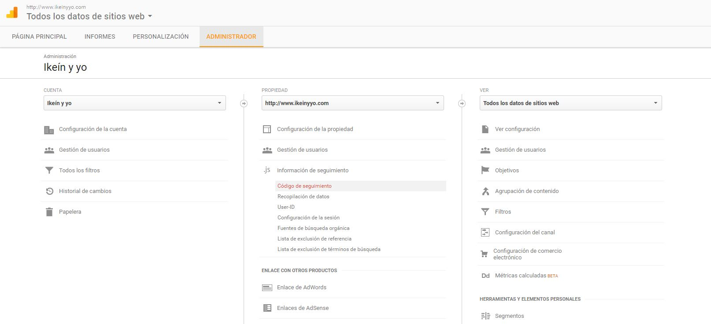
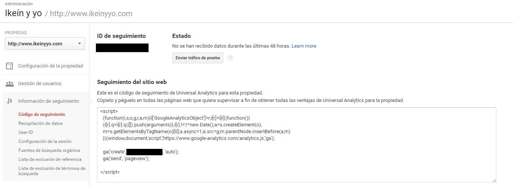
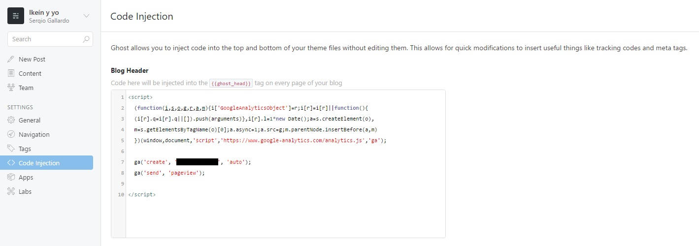
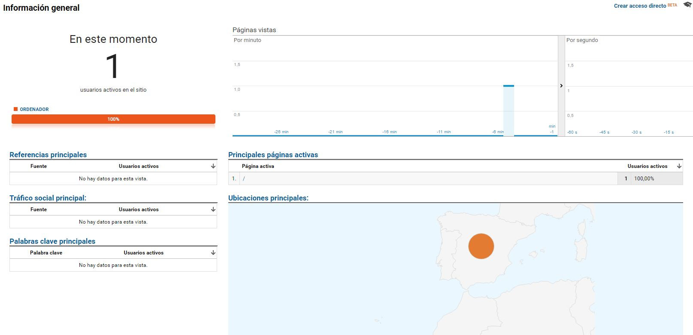

¡Hola a todos! Repasemos lo que tenemos hasta ahora. Tenemos un blog, con [Ghost](http://www.ikeinyyo.com/hola-mundo/). Tenemos comentarios, con [Disqus](http://www.ikeinyyo.com/disqus-cometarios-en-ghost/). Y para acabar necesitamos estadísticas… con Google Analytics.

Vamos a ver que es súper sencillo utilizar Google Analytics con nuestro blog en Ghost.

## Registro en Google Analytics

Antes de empezar tenemos que tener una cuenta de [Google Analytics]( https://analytics.google.com/). El proceso es sencillo, necesitamos una cuenta de Google y rellenar toda la información que nos piden para crear una aplicación Web.

## Obtener código de Google Analytics

Una vez entramos en nuestra aplicación de Google Analytics tenemos que acceder a la pestaña de Administración. A continuación, desplegamos Enlace de seguimiento y pulsamos sobre Código de seguimiento.

Aquí podemos ver el código en JavaScript que necesitamos pegar en nuestra web para empezar a disfrutar del seguimiento de Google Analytics.

## Configurar Ghost

La forma más fácil de incluir este código JavaScript en nuestro blog de Ghost es a través del Code Injection del panel de configuración de Ghost.

Basta con añadir el código JavaScript en el Blog Header y guardar la configuración.

## Funcionando

¡Pues ya está! Con esto ya podremos ver estadísticas de nuestro blog. Páginas más visitadas, ubicación de las conexiones, etc.

## Conclusión

Como hemos visto en el blog ha sido súper sencillo pasar de WordPress a Ghost. Hemos renunciado a una gran cantidad de opciones de personalización, plugins, etc pero hemos logrado obtener funcionalidad importante como comentarios y estadísticas en Ghost manteniendo la ligereza de esta plataforma.

¡Nos vemos en el futuro!

