¡Hola a todos! Estaba revisando las [versiones de Minecraft]( http://minecraft.gamepedia.com/Version_history) para saber en qué versión empecé a jugar. Según mi cuenta de Mojang empecé a jugar el 29 de octubre de 2010, por aquel entonces Minecraft estaba en la versión [Alpha 1.1.2_01](http://minecraft.gamepedia.com/Alpha_1.1.2_01).

Quería repasar en este post todos los cambios que ha sufrido Minecraft durante este tiempo para que la gente que juega hoy en día sepa por donde hemos pasado los más viejo del lugar. 

Vamos a ir viendo los cambios más relevantes en la historia de Minecraft.

## El Nether - Alpha 1.2.0

Justo un día después de que yo me comprara el juego, el 30 de octubre de 2010, salió la actualización de Halloween ([Alpha 1.2.0]( http://minecraft.gamepedia.com/Alpha_1.2.0)) que incluía una nueva dimensión: el Nether.

Antes de esta actualización no existía el Nether ni con él los portales, los Ghast y los Zombie Pigman que fueron añadidos en esta versión. Además, añadieron las calabazas y las Jack o’Lanterns.

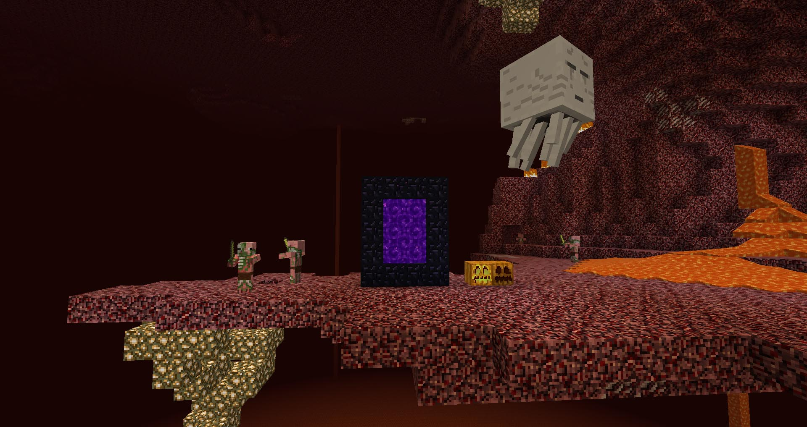

## Las hojas se caen - Alpha 1.2.3

La [versión 1.2.3]( http://minecraft.gamepedia.com/Alpha_1.2.3) de Minecraft se lanza el 24 de noviembre de 2010. Desde que yo empecé a jugar y hasta este momento las hojas de los árboles no se caían solas al cortar el tronco. Cada vez que talabas un árbol tenías que quitar todas las hojas porque si no se quedarían flotando en el aire.

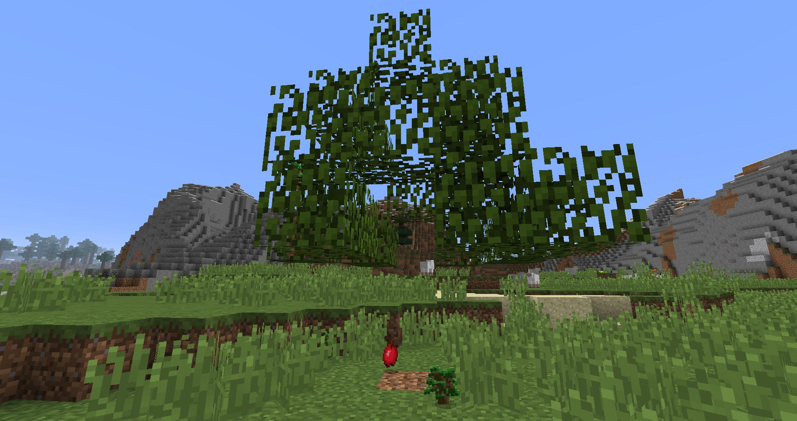

Parece un cambio pequeño pero que todos los jugadores de Minecraft de esa época agradecimos mucho. Esto se acabó modificando en la Beta 1.0.

## Beta 1.0

En la [Beta 1.0](http://minecraft.gamepedia.com/Beta_1.0) de Minecraft, lanzada el 20 de diciembre de 2010, dejamos atrás la versión Alpha del juego. No hay grandes cambios en cuanto al contenido. Lo más destacable es que se pueden lanzar huevos con la posibilidad de que salga un pollo.

## Nuevos árboles - Beta 1.2

La [Beta 1.2](http://minecraft.gamepedia.com/Beta_1.2) fue la primera versión en la que aparecieron nuevos tipos de árboles. Añadieron el Birch y el Pine que más tarde sería sustituido por el Spruce. 

> Fue lanzada el 13 de enero de 2011. 

Además, añadieron muchos otros ítems como por ejemplo Charcoal, Dispensers, Lapis lazuli, etc.

En esta versión también añadieron el resto de colores de las lanas y la posibilidad de encontrar ovejas con lana gris y negra de forma natural.

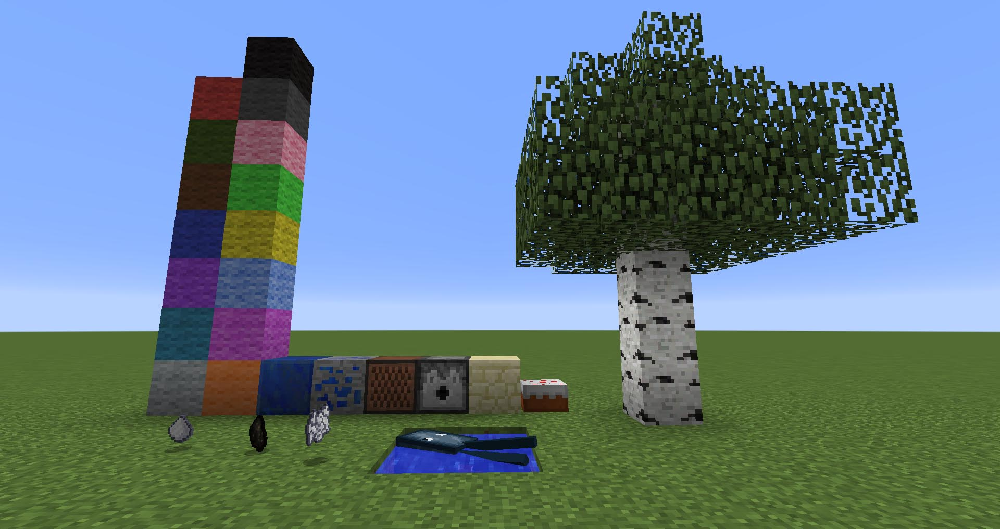

También se aumentó la cantidad de oro, hierro y diamante en la generación de mundo.

## Slimes - Beta 1.2_01

En la versión [Beta 1.2_01]( http://minecraft.gamepedia.com/Beta_1.2_01) volvieron a incluir los Slimes en el juego, aunque con muy poca probabilidad de spawn. A partir de esta versión ya no volverán a desaparecer.

> La versión Beta 1.2_01 se publicó el 14 de enero de 2011.

## ¡A dormir! - Beta 1.3

Por fin en la versión [Beta 1.3](http://minecraft.gamepedia.com/Beta_1.3) de Minecraft incluyen las camas en el juego. Se publicó el 22 de febrero de 2011.

Hasta esta versión no había forma de pasar la noche en Minecraft. Cuando dormías en zonas en las que podían spawnear enemigos automáticamente te despertabas con zombies o esqueletos cerca del jugador.

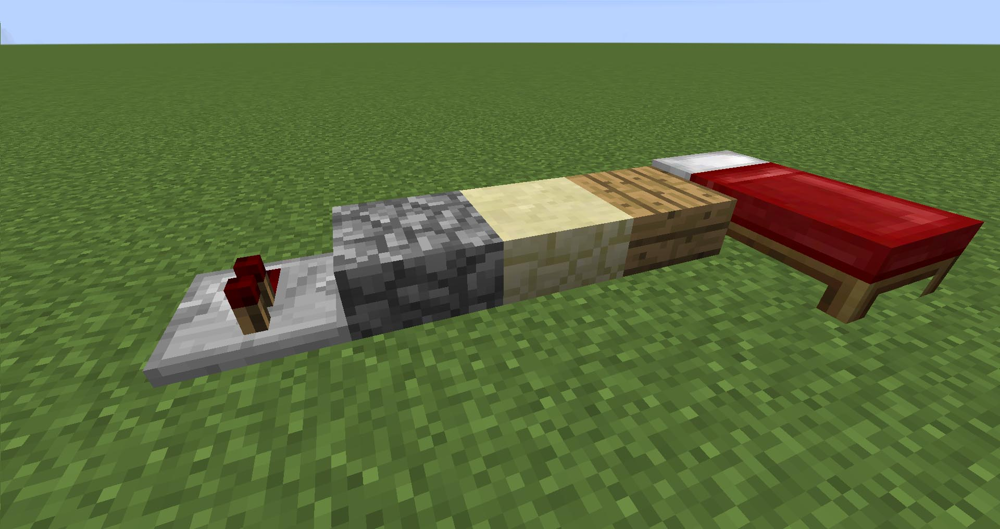

> También se añadieron los primeros medios bloques (slabs) y los repeaters.

## Lobos y galletas - Beta 1.4

Pese a que ya había camas desde la Beta 1.3 no fue hasta la [Beta 1.4](http://minecraft.gamepedia.com/Beta_1.4) cuando sirvieron para cambiar el punto de spawn que hasta entonces solo se podía cambiar con comandos. Esta versión supuso un gran cambio en el modo de juego ya que los jugadores podían alejarse del punto de spawn.

Se añaden también los lobos. Es el primer mob que se puede domesticar en Minecraft. Además, se añaden las galletas.

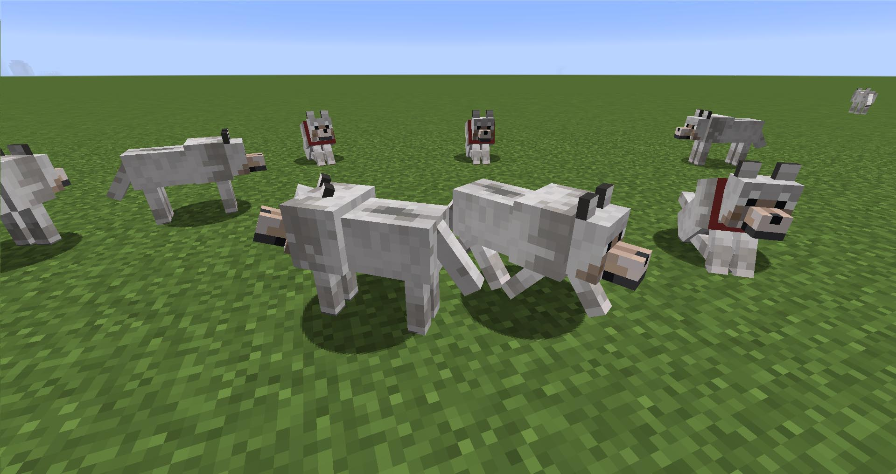

> La versión Beta 1.4 se publicó el 31 de marzo de 2011.

## Nether en multiplayer y fuego bajo control – Beta 1.6

En la [Beta 1.6](http://minecraft.gamepedia.com/Beta_1.6) de Minecraft añaden el soporte al Nether en multiplayer. Además, a partir de esta versión si intentas dormir en el Nether la cama explota matando al jugador. Esta versión se publicó el 26 de mayo de 2011.

Pero el cambio más importante fue que hicieron que el fuego se extendiera más lentamente y no de forma infinita. 

Esto podía causar un gran problema en un mundo de Minecraft ya que un pequeño incendio en un bosque podía suponer que pierdas todo el mapa ya que el fuego se extendía de forma infinita provocando que el juego se bloqueara.

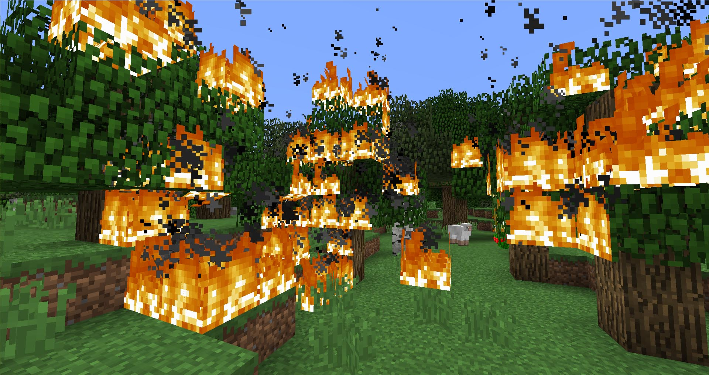

Hasta esta versión era común tener cortafuegos a lo largo de los bosques para evitar estas situaciones.

## La revolución industrial - Beta 1.7

El 30 de junio de 2011 se lanzó la versión [Beta 1.7](http://minecraft.gamepedia.com/Beta_1.7) de Minecraft que supuso una gran revolución ya que añadían los pistones. Con este cambio se empezaron a construir una gran cantidad de mecanismos y automatizaciones. 

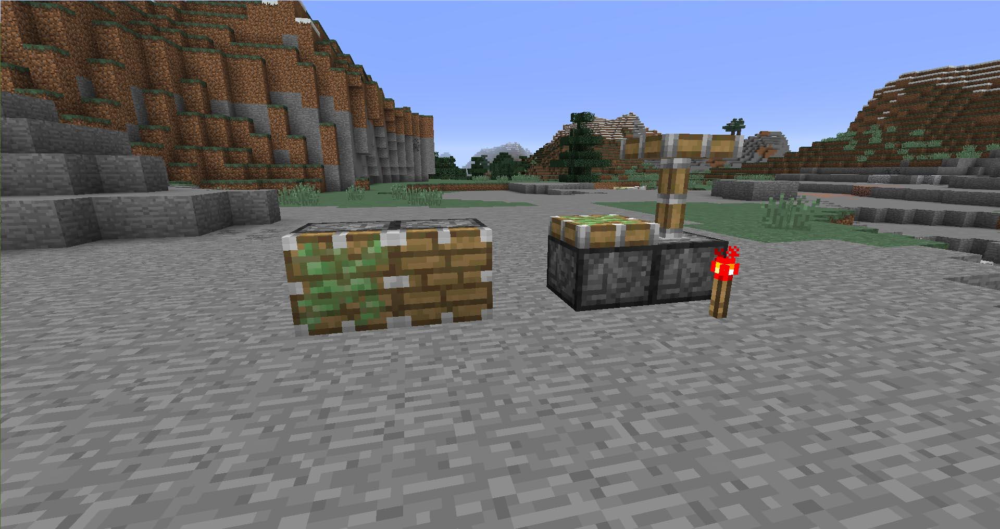

> También se añadieron las tijeras con las que podéis esquilar a las ovejas y obtener las hojas de los árboles.

## Adventure Update - Beta 1.8

Esta es una de las actualizaciones más importantes de Minecraft. La [Beta 1.8](http://minecraft.gamepedia.com/Beta_1.8) se publicó el 15 de septiembre de 2011 y fue llamada la *Adventure Update*.

En esta versión se añade el modo creativo. Pero el mayor cambio se produce en el modo supervivencia. 

**Se añade la barra de comida:** Hasta este momento la comida recuperaba vida del jugador. A partir de la Beta 1.8 se crea la barra de comida y el nuevo sistema de regeneración de vida. Además, toda la comida excepto la sopa de setas pasas a ser *stackeable*.

**Nuevas comidas:** Se añaden nuevas comidas entre ellas la carne de pollo y de vaca. Hasta este momento solo teníamos disponible carne de cerdo.

**Se puede correr:** Aunque parezca mentira **hasta la Beta 1.8 de Minecraft no se podía correr**. En esta versión sólo se puede correr pulsando dos veces seguidas la W. Este comportamiento cambiaría en futuras versiones pudiendo correr pulsado la tecla Control.

**Se añaden estructuras:** Esta se considera la actualización de la aventura. Por ello se añadieron diferentes estructuras en la generación del mundo para incitar al jugador a explorar. Se añaden las **aldeas**, **Strongholds**, **minas abandonadas** y **cañones**.

Hay un cambio en la generación de los biomas a partir de la [Beta 1.8](http://minecraft.gamepedia.com/Biome/Before_Beta_1.8).

**Los zombies cambian su *dropeo*:** Los zombies ya no sueltan plumas al morir sino que sueltan carne de zombie (Rotten Flesh).

**Los animales no hacen despawn:** Otro gran cambio de esta versión fue que los animales ya no hacia despawn como los mobs hostiles. Ahora ya podíamos hacer ranchos y almacenar los animales. Hoy en día es impensable que los animales hagan despawn.

**Nuevos mobs:** Se añaden los Enderman, Silverfish y las arañas de cueva.

**Experiencia:** Se añade la barra de experiencia que podemos obtener al matar enemigos.

> Los animales no despawnean, podemos correr y tenemos barra de comida y de experiencia.

### La primera gran actualización

Sin duda esta es la primera gran actualización de Minecraft y una de las más importantes. Cambia por completo el modo de supervivencia al meter nuevos mecanismos para la comida y la experiencia. 

Además, hace que el jugador tenga que explorar para poder encontrar esas estructuras que se generan. En esta versión también se añade la posibilidad de que el jugador pueda correr.

También sirve como punto de partida para poder establecer granjas de animales (aunque aún no se podía criar a los animales).

## Primera versión de Minecraft - 1.0.0

El 18 de noviembre de 2011 se publicó la primera versión de Minecraft, la [1.0.0](http://minecraft.gamepedia.com/1.0.0).

Esta primera versión supone en fin de las versiones de desarrollo y aporta muchas cosas nuevas justo después de una actualización tan grande como la Beta 1.8.

> Se añade el modo Hardcore

Se añaden nuevas mecánicas:

* Pociones
* Encantamientos
* Reparación de ítems
* Criar animales

Además, hay un cambio en la generación del mundo con nuevos biomas y estructuras. Se añaden las **fortalezas del Nether**, el **The End**, el **portal al The End** en los Strongholds y las **islas de setas**.

También se añadieron nuevos mobs como los **aldeanos** y el **Ender Dragon**. Recordamos que había aldeas desde la Beta 1.8 pero no había aldeanos. Además, al añadir el The End se incluye el Dragón y con él un *final* al juego.

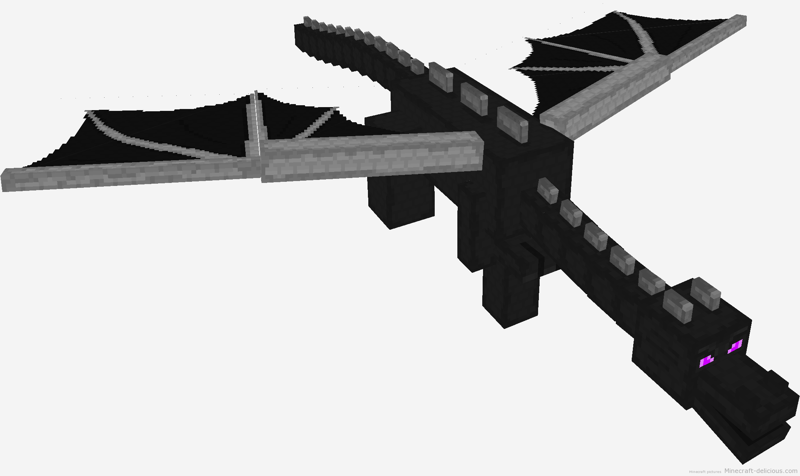

En el Nether también se añaden nuevos enemigos: **Blaze** y **Magma Cube**.

La aparición de las pociones hace necesario la aparición y dropeo de nuevos ítems: **barrita de Blaze**, **lágrima de Ghast**, **Margma Cream**, etc…

Se añade el uso a las **Ender pearls** para permitir teletrasportarse.

## Criar animales

Otro aspecto muy importante que cambió en parte como es Minecraft hoy en día fue la posibilidad de criar animales. Desde la versión Beta 1.8 los animales no hacían *despawn* pero no había manera de poder criarlos. Desde esta versión los animales se pueden atraer con trigo y se pueden reproducir.

Gracias a esto los jugadores ya tenían una forma de tener granjas de animales y tener una forma de comida animal estable.

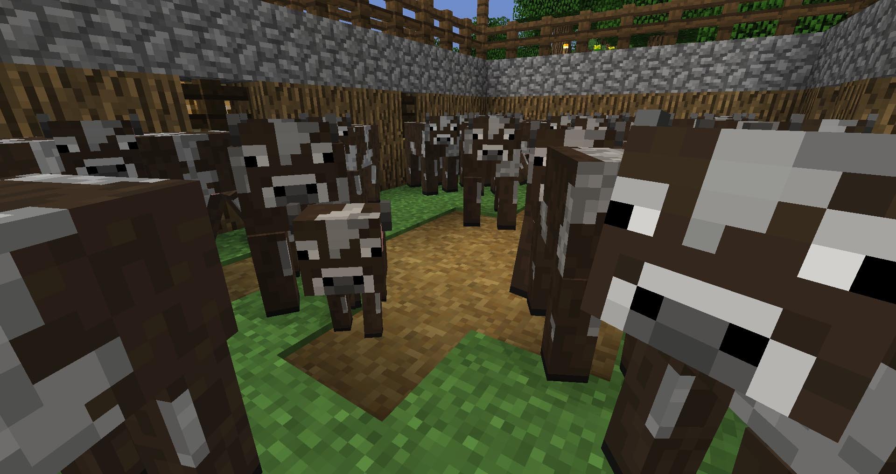

## Encantamientos

En esta versión de Minecraft los encantamientos funcionaban un poco diferente a como es ahora. Había encantamientos hasta nivel 30 y gastabas tantos niveles como el encantamiento indicara. Por tanto, encantar dos veces a nivel 30 era muy difícil. En la actualizad encantar a nivel 30 solo gasta 3 niveles más 3 de lapis lazuli.

> Gran actualización: criar animales, encantamientos, pociones, The End...

## Jungla - 1.2.1

El 1 de marzo de 2012 se publicó la versión [1.2.1](http://minecraft.gamepedia.com/1.2.1) de Minecraft. Lo más destacable de esta versión fue la inclusión de la jungla en la generación del mundo.

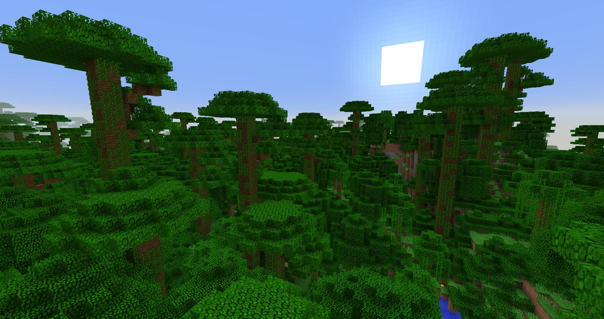

> Se añadieron también los Ocelotes

Otro cambio muy importante fue que incluyeron el **Golem de hierro**. El Golem de hierro es uno de los mobs que más me gustan de Minecraft, además, supuso un cambio muy grande en Minecraft técnico porque daba la posibilidad de poder hacer granjas de hierro.

Los Golems de hierro aparecen en esta versión para proteger a los aldeanos de los Zombies ya que es también desde esta versión cuando los Zombies persiguen a los aldeanos.

## Esmeraldas - 1.3.1

En la versión [1.3.1](http://minecraft.gamepedia.com/1.3.1), publicada el 1 de agosto de 2012, añaden las esmeraldas y con ellas la posibilidad de hacer intercambios con los aldeanos.

> Se añade el Ender Chest y los templos del desierto y de la jungla.

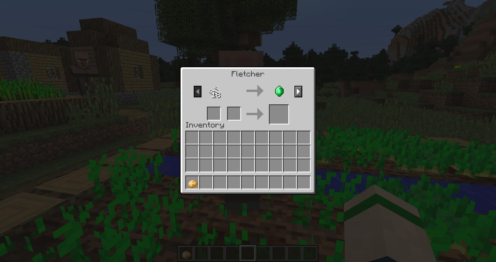

## Pretty Scary Update - 1.4.2

La primera gran actualización de la versión estable de Minecraft fue la [1.4.2](http://minecraft.gamepedia.com/1.4.2), publicada el 25 de octubre de 2012, que incluía nuevos mods, entre ellos el Wither.

> Se añaden los yunques, los Beacons, patatas, zanahorias…

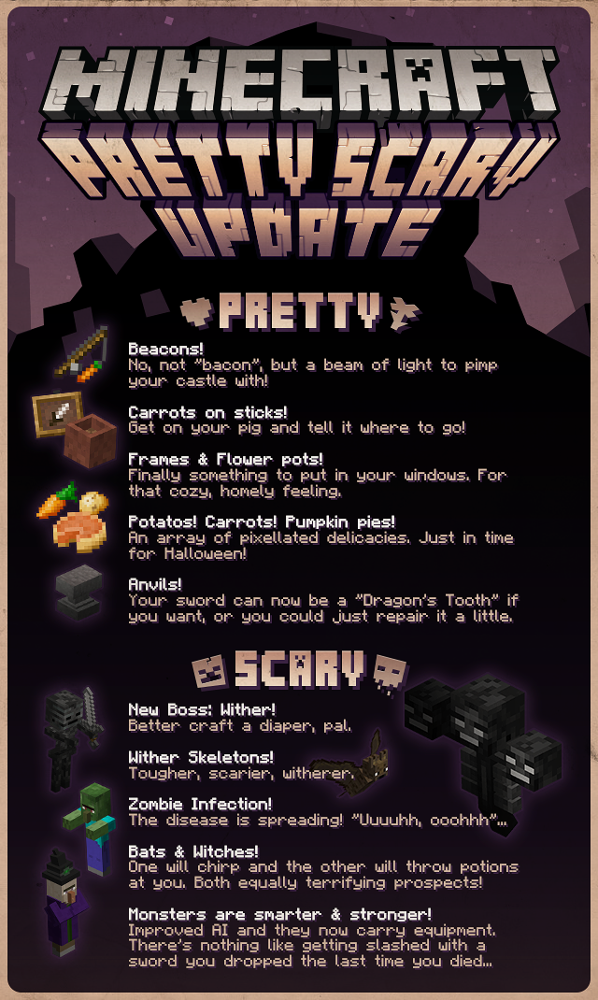

En esta actualización se añadieron 4 mobs nuevos: los **murciélagos**, las **brujas**, los **wither skeletons** y el **Wither**. El Wither se convierte en el segundo *boss* de Minecraft. En este caso lo tenemos que invocar nosotros y al derrotarlo obtenemos la Wither Star que nos permite fabricar beacons.

## Redstone Update - 1.5

Sin duda una de las actualizaciones más importante para Minecraft técnico: la [1.5](http://minecraft.gamepedia.com/1.5), la Redstone Update.

El 13 de marzo de 2013 se publicó esta actualización que junto con la Beta 1.7 completa la revolución industrial.

En esta versión se hace un cambio muy importante en el funcionamiento de la Redstone. Esto supone un punto de inflexión y muchos mecanismos de versiones anteriores dejan de funcionar. 

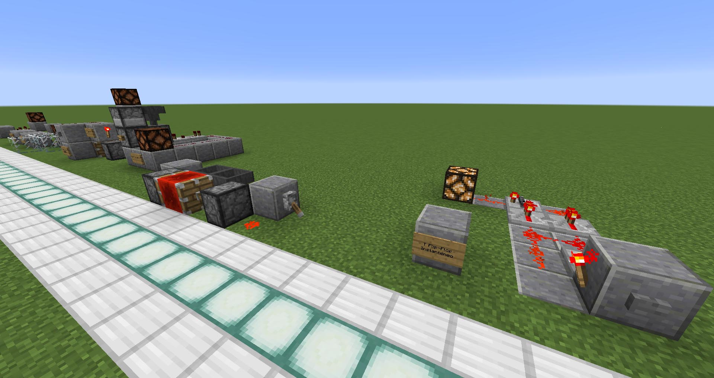

Además, en esta versión se añaden cosas muy importantes para trabajar con Redstone: **hoppers**, **droppers**, **sensor de luz**, **comparator**, **bloque de Redstone**.
