¡Hola a todos! Hoy quiero hablar de Minecraft técnico. Me gustaría enseñarle a todo aquél que no conozca Minecraft el por qué creo que se puede hacer ingeniería en Minecraft. ¡Vamos allá!

## Redstone: la clave de todo

En Minecraft existe un ítem llamado [Redstone]( http://minecraft.gamepedia.com/Redstone) que es un polvo que funciona como conductor. Existen [ítems]( http://minecraft.gamepedia.com/List_of_redstone_components) que son capaces de interactuar con el polvo de Redstone.

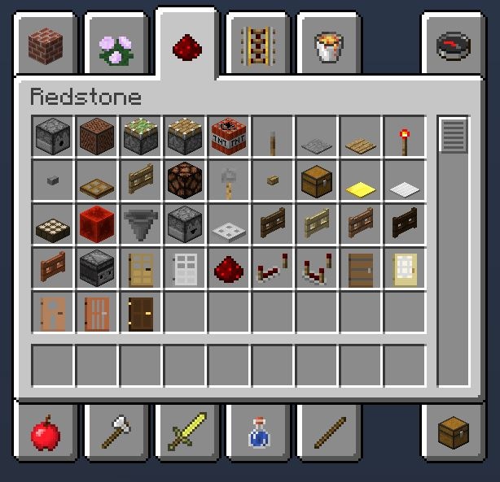

Por ejemplo, podemos poner un interruptor, polvo de Redstone para conducir la señal y una lámpara que se enciende si recibe un impulso.

Con la Redstone se pueden hacer [puertas lógicas]( http://minecraft.gamepedia.com/Tutorials/Basic_logic_gates) y a partir de ahí se abre todo un mundo de posibilidades. Algunos ejemplos:
* [Minecraft Redstone Computer Word Processor](https://www.youtube.com/watch?v=g_ULtNYRCbg)
* [Redstone RAM - Random Access Memory](https://www.youtube.com/watch?v=dBKdibZvb_E)

Y otras muchas cosas. Pero esto es Redstone avanzada, tampoco es lo que vamos a ver en este post.

## Entender cómo funciona Minecraft
Este es un punto importante también, porque la mayoría de cosas que vamos a ver han sido posible por entender cómo funciona Minecraft y cómo está programado. 

Por ejemplo, Minecraft detecta que hay una aldea en función de que haya puertas con bloques encima (como si fuera un techo), el número de aldeanos, etc. Gracias a esto podremos hacer una granja de hierro. ¡Lo veremos más adelante! 😁

Vamos a ver algunas de las impresionantes cosas que se pueden hacer en Minecraft.

## McPollo
El McPollo nos va a permitir tener comida infinita sin necesidad de hacer nada. Necesitamos saber algunos conceptos básicos de Minecraft.

* Los pollos ponen huevos.
* Si lanzamos un huevo hay una probabilidad de que salga un pollo pequeño.
* Los dispensadores de Minecraft pueden lanzar huevos.
* Los pollos ocupan 1 bloque mientras que los pollos pequeños ocupan medio bloque.
* Los hoppers (tolva en español) conducen los ítems hacia donde esté apuntando.

Una vez sabemos esto podemos ver cómo se construye y cómo funciona el McPollo.

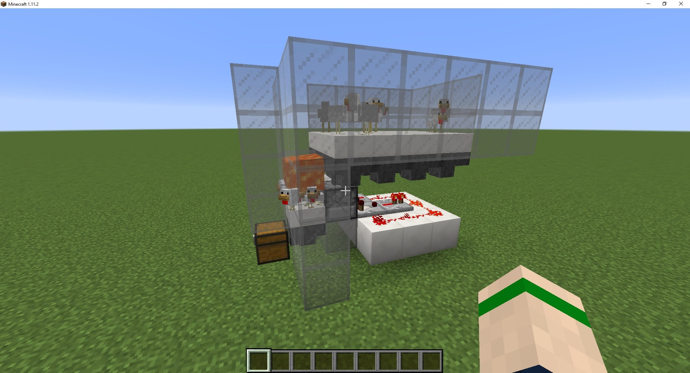

Básicamente en la parte superior tenemos pollos que tienen debajo unos hoppers que llevan todos los huevos que ponen hacía el dispensador. En el dispensador hay un pequeño circuito que cuando detecta un ítem le da un pulso de Redstone para que lo lance.

Con eso conseguimos lanzar todos los huevos que ponen los pollos. Los lanzan a un hueco de medio bloque que es donde esperarán los pollos a hacerse grandes. Cuando crezcan la lava que tiene encima los quemarán y con otro Hopper almacenaremos el pollo cocinado en un cofre.

Este concepto lo podemos adaptar a nuestro gusto. 

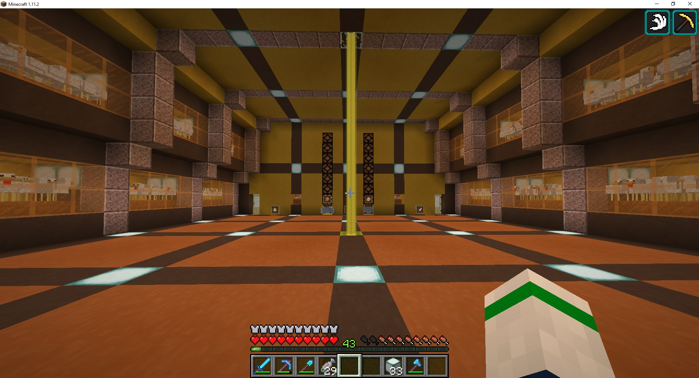

En mi caso tengo varias plataformas con pollos ubicadas a los lados y conectadas a dos áreas con lava. Luego todo el pollo resultante va a un sistema de almacenamiento masivo con luces que indican cuanta cantidad hay. 

**Nota:** Podemos obtener pollo crudo si sustituimos la lava por agua. Así los pollos morirán ahogados en vez de quemados.

## Sistema de almacenamiento con indicador luminoso

Como hemos visto en mi McPollo todo lo obtenido va a un sistema de almacenamiento masivo con un indicador luminoso que me indica cómo de lleno está.

Este concepto es muy simple. Únicamente tenemos que tener cofres conectados con hoppers. A esos hoppers le pondremos un comparador que lanzará una señal siempre que haya algún ítem en el hopper. De esta forma cuando se llene un cofre los demás ítems se quedarán en el hopper hasta completarlo y luego se seguirán almacenando en el siguiente cofre.

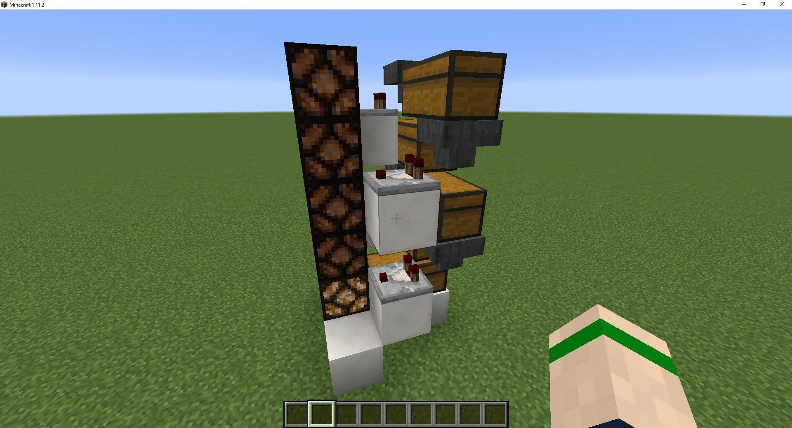

Mientras haya ítems en el hopper el comparador lanzará una señal de Redstone. Pondremos lámparas de Redstone que se encienden cuando reciben un impulso.

En mi caso y combinado con unos filtros puedo llegar a almacenar una gran cantidad de ítems.

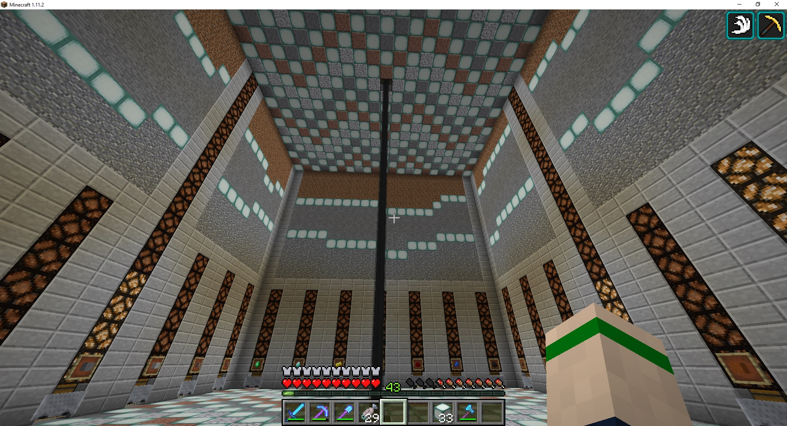

## Filtro de ítems
En Minecraft no existe un objeto que nos ayude a filtrar lo ítems cuando trabajamos con hoppers y nos permitan separarlos para almacenarlos en diferentes cofres. Pero eso no ha impedido que la comunidad de Minecraft descubra la manera de cómo hacerlo.

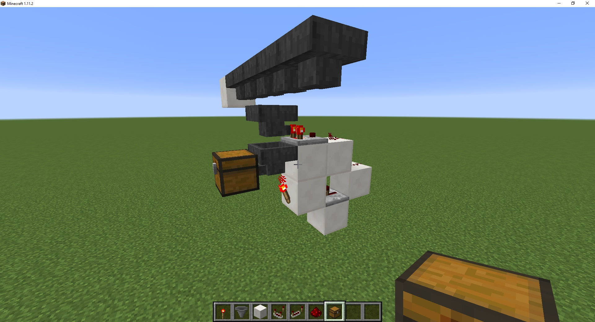

Los ítems viajan por la fila de hoppers superior. Cuando se encuentra con otro hopper debajo intenta dejar caer los ítems al hopper de abajo. 

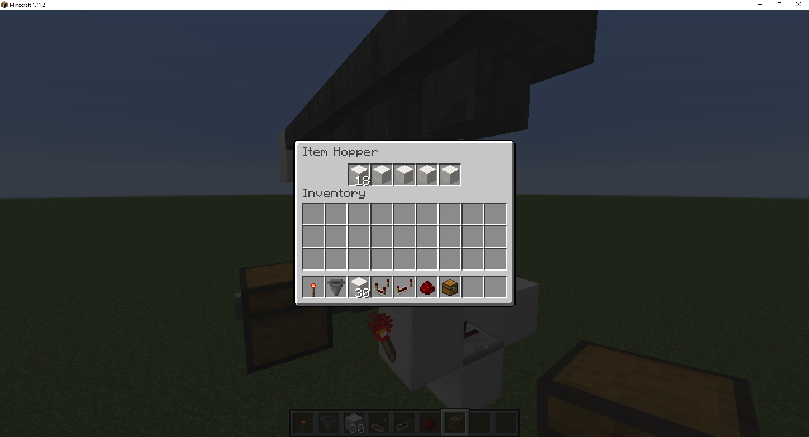

Si llenamos todos los slots del hopper de abajo con el ítem que queremos filtrar solo los ítems que nos interesan bajarán por ese hopper. Pero necesitamos una forma de bloquear el hopper para que no se vacíen todos los slots. Para ello tenemos el circuito que vemos detrás. Con un comparador hacemos que cuando haya más de 22 ítems en el hopper apague la antorcha de Redstone de abajo y desbloquee el hopper para dejar pasar un ítem. 

Gracias a esto podemos dejar todos nuestros ítems en un cofre y hacer que se vayan ordenando.

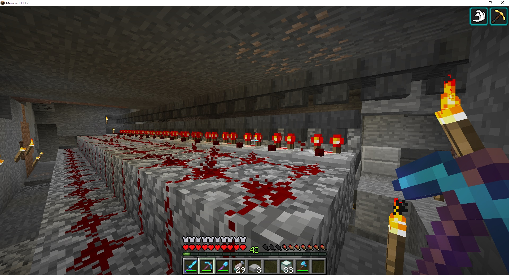

## ¿Sigues sin pensar que se puede hacer ingeniería en Minecraft?
Hasta ahora hemos visto algunos mecanismos que trabajan con la Redstone. Pero Minecraft técnico va un poco más allá. Ahora veremos algunos ejemplos de cosas que se pueden hacer aprovechándonos de cómo funciona Minecraft.

# Granja de hierro
Antes de empezar os diré que se pueden hacer granjas mucho más eficientes que la mía, por ejemplo la [Iron Tower]( https://www.youtube.com/watch?v=UKP-WvCdo9s) que es capaz de generar 1300 lingotes de hierro por hora.

La granja de hierro se ayuda de cómo funciona Minecraft. Cuando Minecraft detecta que hay una aldea y un número determinado de aldeanos genera un Golem de Hierro para protegerlos. Estos Golems al morir suelta hierro y flores rojas.

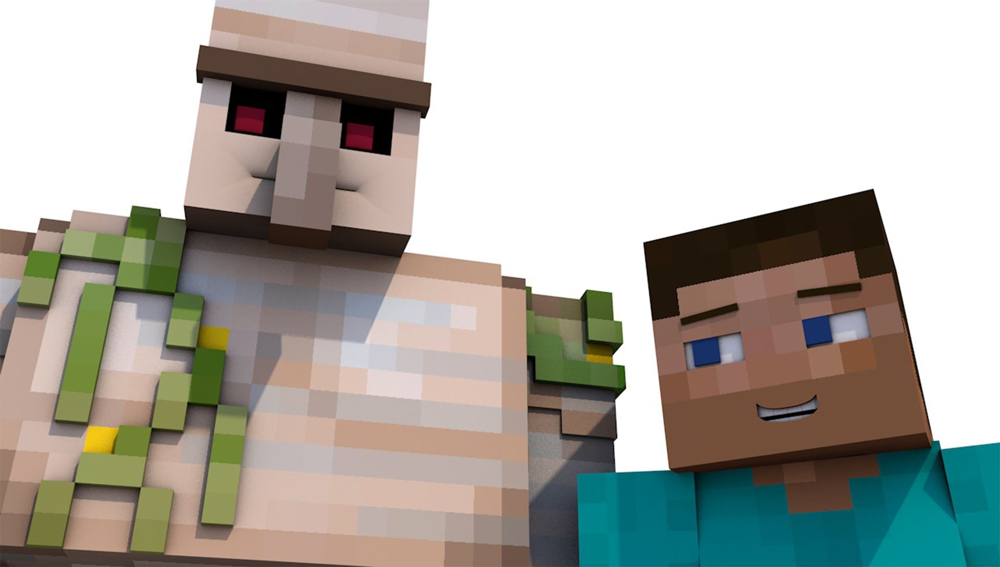

La granja que tengo yo en mi mundo es muy sencilla. Basta con construir la siguiente estructura.

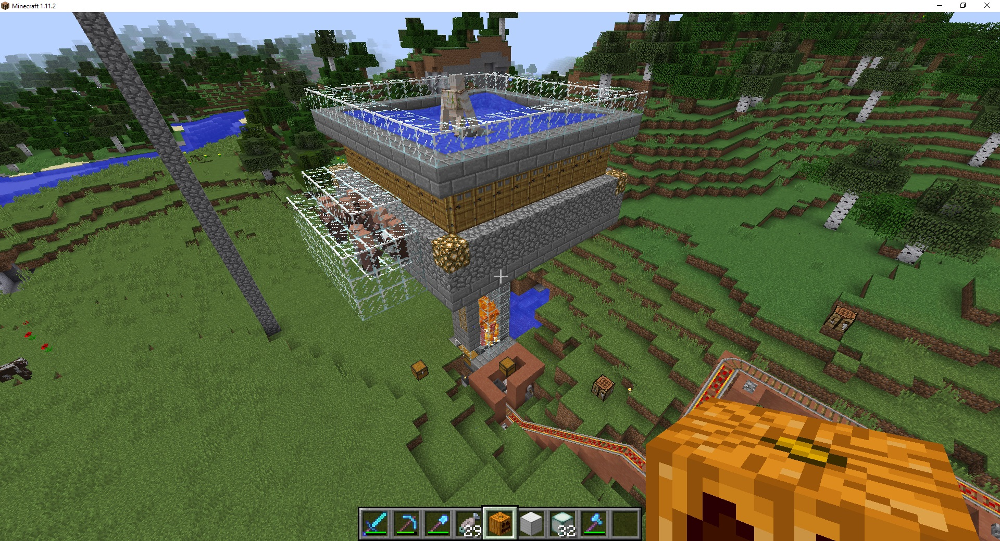

Podemos ver que hay una gran cantidad de puertas con techo y 10 aldeanos. Con esto Minecraft ya es capaz de hacer aparecer Golems de Hierro. Éstos aparecen en la corriente de agua que los lleva a la lava donde mueren y dejar caer el hierro y las flores a un cofre.

Mi granja de hierro produce unos 90 de hierro por hora. Para compensar lo poco eficiente que es construí 4 granjas de hierro, de esa forma soy capaz de obtener unos 360 lingotes de hierro por hora. Pero para incrementar aún más la producción de hierro las construí en los Spawn Chuncks. 

Los Spawn Chuncks son una porción del mundo de Minecraft donde apareces por primera vez al crear el mundo. Estos trozos de terreno siempre están cargados, aunque estés muy lejos de ahí. Por tanto, al estar siempre en ejecución siempre estoy generando hierro.

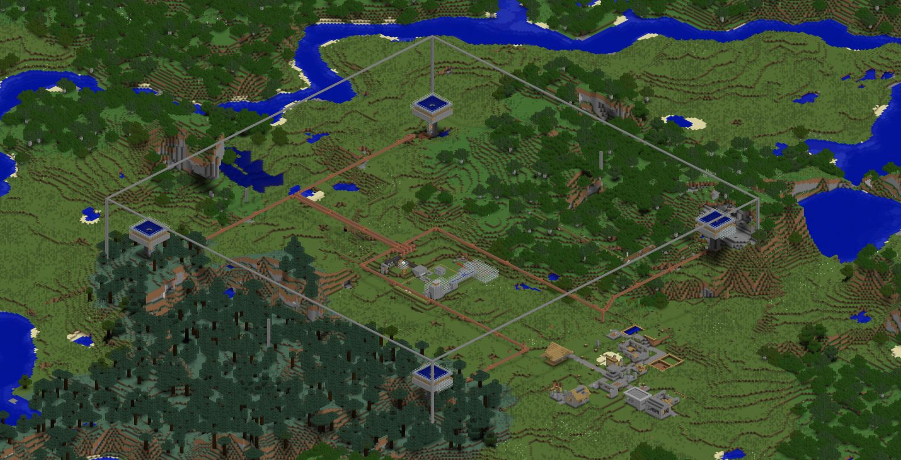

Por último, uní todas las granjas con unas vagonetas que me transportan el hierro a un solo sitio. Con esto nunca más tendrás que ir a buscar hierro a la mina.

## Granja de Guardianes
La granja de guardianes es sin duda el proyecto más tedioso al que me he enfrentado en Minecraft.

En Minecraft existen unas estructuras que son los templos del mar. Estos templos se generan de forma aleatoria en el bioma de océano. En el agua de los alrededores de esos templos aparecen unos enemigos que se llaman guardianes. 

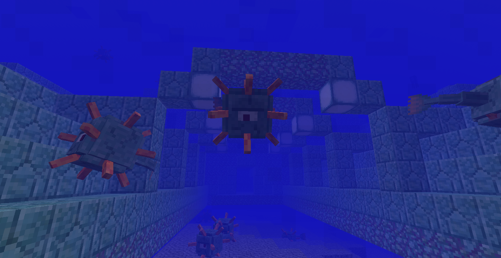

Los guardianes al morir sueltan pescado y unos ítems para fabricar los bloques del templo.

Para hacer una granja de guardianes tenemos que vaciar toda la zona de agua que hay alrededor del templo, para luego crear una piscina en el centro con unas corrientes de agua que lleven a todos los guardianes a la lava. De esta forma obligamos a Minecraft a que los guardianes solo aparezcan en la zona que nosotros hemos preparado.

Aquí podemos ver la granja terminada

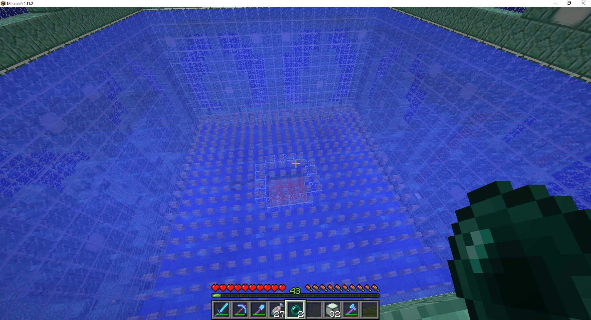

## Granja de Enderman
Por último, os voy a enseñar la granja de Enderman. Ésta se basa en un principio que utilizan otras muchas granjas de mobs: solo aparecen mobs en un rango de 128 bloques alrededor del jugador.

La granja de Enderman hay que hacerla en el The End. El The End es una dimensión de Minecraft en la que el mob principal que aparece son los Endermen. Es una isla flotando en la nada que está repleta de Endermen.

Lo que vamos a hacer es alejarnos más de 128 bloques de la isla para hacer nosotros nuestra propia zona de aparición de Endermen. Al alejarnos esa distancia de la isla nos aseguramos que solo aparezcan Endermen en las zonas que habilitemos para ello. En este caso será una plataforma a una cierta distancia de suelo. 

**Nota:** En la imagen vemos dos versiones diferentes de una granja de Endermen.

Dejaremos unos huecos para que los Endermen puedan caer y pondremos un Endermite en medio. Los Endermen se siente atraídos por el Endermite y al ir a por él caen por los huecos que hemos dejado, se hacen daño por caída y se quedan a un solo golpe de morir.

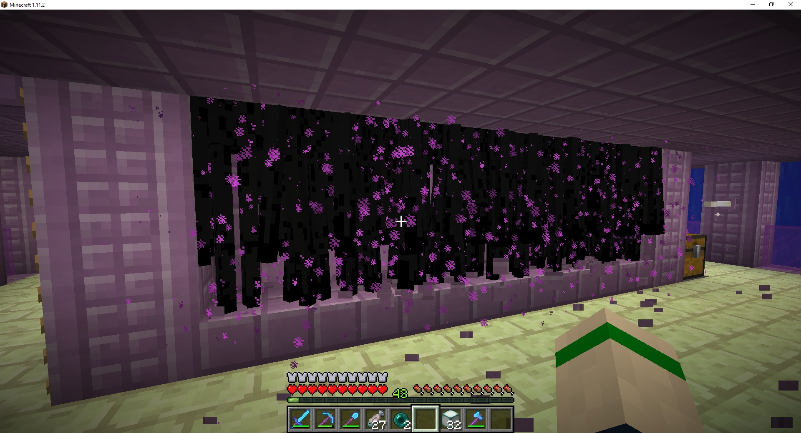

Así solo tenemos que darles un solo golpe para matarlos y conseguir experiencia.

## En definitiva

Si tuviera que contar todas las cosas que he hecho en Minecraft y las que me quedan por hacer no acabaríamos nunca. Pero con esto la gente que no conoce esta faceta de Minecraft se puede hacer una idea de todo lo que da de sí. Y sí, se puede hacer ingeniería en Minecraft.
