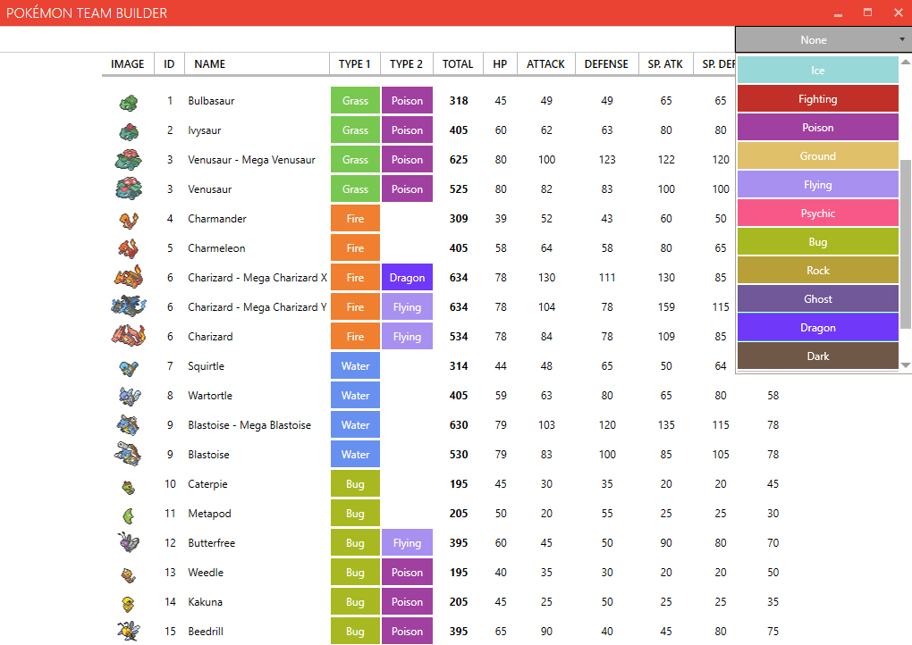

¡Hola a todos! Hoy vamos a ver un **Microspost** de cómo obtener todos los valores de un enumerado.

> Un **Micropost** es un post pequeño que sirve para tratar cosas sencillas pero que a veces se nos pueden olvidar. Es una forma de tenerlo siempre presente.

## Obtener todos los valores de un enumerado.

Obtener todos los valores de un enumerado es bastante sencillo. Lo único que tenemos que hacer es llamar al método estático `Enum.GetValues`, pasándole el tipo de nuestro enumerado. Por último, utilizamos Linq para *castear* todos los valores a nuestro tipo de enumerado.

```csharp
Enum.GetValues(typeof(MyEnumType)).Cast<MyEnumType>();
```

Con esto obtenemos un IEnumerable de nuestro enumerado con todos los valores.

## Ejemplo de uso

Un ejemplo muy claro es tener un enumerado en un ComboBox para filtrar. En este caso vamos a ver un enumerado con el tipo de Pokémon.

### ViewModel

En el ViewModel tenemos un IEnumerable<PokemonType> que vamos a *bindear* en la vista. Rellenamos el IEnumerable con todos los valores del enumerado.

```csharp
private IEnumerable<PokemonType> pokemonTypes;

public MainViewModel()
{
    PokemonTypes = Enum.GetValues(typeof(PokemonType)).Cast<PokemonType>();   
}

public IEnumerable<PokemonType> PokemonTypes
{
    get { return pokemonTypes; }
    set
    {
        pokemonTypes = value;
        NotifyOfPropertyChange();
    }
}
```

### View

```xaml
<ComboBox ItemsSource="{Binding PokemonTypes}" SelectedItem="{Binding SelectedType, Mode=TwoWay}" />
```

### Resultado

Como vemos en el resultado, hemos podido obtener todos los tipos de Pokémon, que son todos los posibles valores del enumerado `PokemonType`.



> Podéis ver el código de esta aplicación [WIP] en mi [Github](https://github.com/maktub82/pokemon-team-builder).

Y hasta aquí el primer Micropost. Espero que os sea útil 😊.

¡Nos vemos en el futuro!