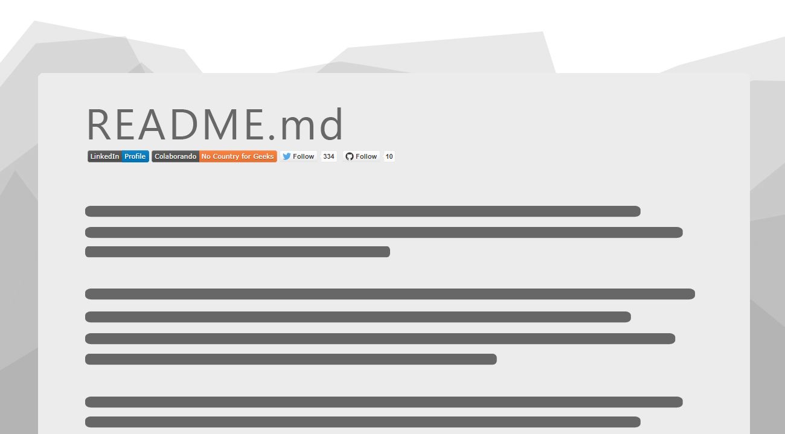
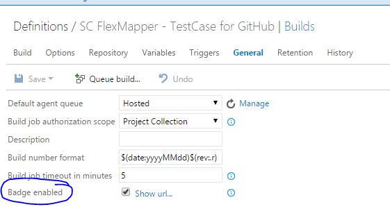

# Shields.io



¡Hola a todos! Hoy vengo a hablar de esos iconos que vemos muchas veces en los *readme* de GitHub que indican cosas como el número de descargas, el estado de la *build*, la cobertura de los tests, etc.

Esto no es ni más ni menos que [Shields.io](https://shields.io/).

## Cómo funciona Shields.io

[Shields](https://shields.io/) es una plataforma que nos ofrece una serie de etiquetas para añadir en nuestros *readme* o webs que nos ofrece información de distinto ámbito.

El funcionamiento es muy sencillo. Esta web nos ofrece una imagen generada con la información obtenida de diferentes fuentes de datos como Twitter, Github, VSTS, etc.

Por ejemplo podemos poner una etiqueta con los seguidores en Twitter.

[](https://twitter.com/maktub82)

Esto es básicamente una imagen generada con una serie de parámetros en la URL.

```html
// Formato
https://img.shields.io/twitter/follow/USER_TWITTER.svg?style=social&label=Follow
```

Para añadirlo en el markdown podemos crear un enlace que contenga como contenido esta imagen y apunte a nuestro twitter.

```markdown
[](https://twitter.com/maktub82)

// Siguiendo este formato
 ](url_enlace)
```

De esta forma podemos añadir cualquier etiqueta de Shields en nuestros markdowns. Ahora vamos a ver alguna de las opciones que nos ofrece.

## Build

Shields nos ofrece etiquetas para diferentes plataformas de [Build](https://shields.io/#build).

[]()

```markdown


```

### Cómo configurarlo en VSTS

Para poder configurar esta etiqueta de Build en VSTS tenemos que ir a la configuración de la build y activar la opción de *Badge*.

```markdown

```



Al pulsar sobre *Show url...* podemos obtener los parámetros de la URL para rellenar los datos necesarios en Shields.


### Cobertura de código

Además de ofrecer el estado de la Build nos ofrecen la cobertura de código para muchas plataformas como Jenkins, Codecov, TeamCity, etc.


## Downloads

Otra de las etiquetas que podemos poner es el número de [descargas](https://shields.io/#downloads). De nuevo, está disponible en múltiples plataformas.

[]()

Algunas de las plataformas disponibles son GitHub, npm, NuGet, SourceForge, etc.

```markdown


```

## Otras etiquetas

Además de las etiquetas para las Builds y las descargas, Shields nos ofrece otras muchas.

Tenemos la opción de añadir una etiqueta con el versionado de nuestros proyectos.

[]()

También podemos añadir etiquetas de carácter social. Como los seguidores de Twitter o las estrellas en GitHub.

[](https://github.com/maktub82)

Y otras muchas cosas más:

[]()

[]()

[]()

[]()

Podéis ver el listado completo en la página de [shields.io](https://shields.io/).

## Etiquetas personalizadas

Otra opción que tenemos es la de personalizar nuestras propias etiquetas siguiendo este patrón.

```markdown

https://img.shields.io/badge/TAG-VALUE-COLOR.svg

[](http://www.nocountryforgeeks.com/author/gallardo)
```

[](http://www.nocountryforgeeks.com/author/gallardo)

De esta forma podemos poner enlaces más vistosos.

## En resumen...

Como veis, es una gran forma de darle un poco de vida a nuestros *readme* y posts.

Podemos añadir mucha información para proyectos colaborativos como el estado de la build, las pull requerst, la cobertura de código, etc. gracias a la gran cantidad de plataformas que soporta.

Creo que voy a empezar a añadir alguna de estas etiquetas en los proyectos en los que participe. Os animo a hacer lo mismo.

Un saludo y ¡nos vemos en el futuro!

[](https://twitter.com/maktub82)
